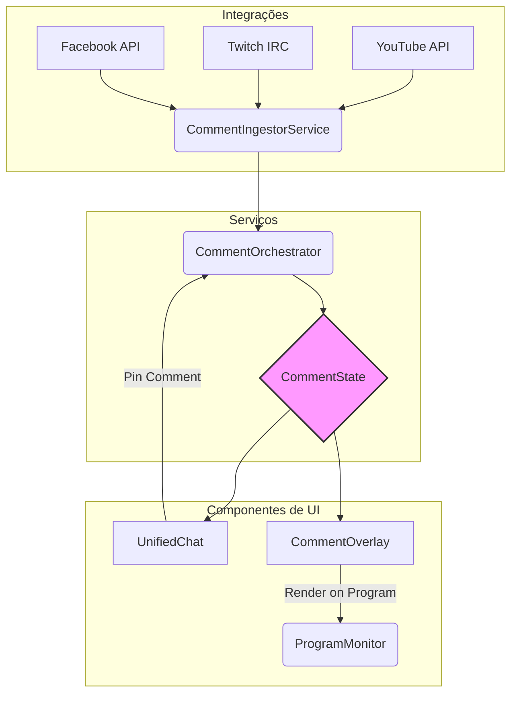

# 🚀 Arquitetura do Sistema de Comentários ao Vivo

**Autor:** Manus AI  
**Data:** 13 de Dezembro de 2025  
**Status:** Proposta

---

## 1. Visão Geral

Este documento descreve a arquitetura proposta para o sistema de **Comentários ao Vivo** do OnnPlay Studio, um recurso inspirado no StreamYard [1] que permite exibir comentários de espectadores na tela da transmissão em tempo real. O objetivo é criar um sistema robusto, flexível e com recursos superiores aos da concorrência.

## 2. Requisitos Funcionais

O sistema deve atender aos seguintes requisitos:

- **RF-01:** Coletar comentários de múltiplas plataformas (YouTube, Twitch, Facebook) em tempo real.
- **RF-02:** Exibir comentários em um chat unificado no studio.
- **RF-03:** Permitir que o streamer selecione comentários para exibir na tela (modo manual).
- **RF-04:** Exibir todos os comentários automaticamente na tela (modo automático).
- **RF-05:** Customizar a aparência dos overlays de comentários (fonte, cor, layout).
- **RF-06:** Reconhecer e exibir badges de usuários (Membro, Moderador, VIP).
- **RF-07:** Destacar mensagens especiais (Super Chats, doações).
- **RF-08:** Fornecer um chat privado para a equipe (backstage).

## 3. Arquitetura Proposta

A arquitetura será baseada no padrão **Observer** e dividida em três camadas principais: **Serviços**, **Componentes de UI** e **Integrações**.

### 3.1. Diagrama da Arquitetura



### 3.2. Descrição dos Componentes

| Componente | Camada | Descrição |
|---|---|---|
| **CommentIngestorService** | Integrações | Responsável por se conectar às APIs das plataformas e coletar os comentários em tempo real. Normaliza os dados para um formato comum. |
| **CommentOrchestrator** | Serviços | Orquestra o fluxo de comentários. Recebe dados do `CommentIngestorService`, gerencia o estado e notifica os componentes de UI. |
| **CommentState** | Serviços | Armazena o estado atual dos comentários, incluindo a lista completa, comentários fixados, e configurações de exibição. |
| **UnifiedChat** | UI | Exibe todos os comentários em uma lista unificada. Permite ao streamer interagir com os comentários (fixar, destacar, deletar). |
| **CommentOverlay** | UI | Componente que renderiza o comentário na tela (no `ProgramMonitor`). Recebe dados do `CommentState` e aplica as customizações. |
| **ProgramMonitor** | UI | O monitor principal que exibe a saída final da transmissão, incluindo o `CommentOverlay`. |

## 4. Modelo de Dados

Para garantir a consistência entre as plataformas, será utilizado o seguinte modelo de dados unificado para os comentários:

```typescript
interface Comment {
  id: string; // ID único do comentário
  platform: 'youtube' | 'twitch' | 'facebook' | 'internal';
  author: {
    name: string;
    avatarUrl: string;
    badges: Badge[];
  };
  message: string;
  timestamp: number;
  isPinned: boolean;
  isStarred: boolean; // Para Super Chats, etc.
  metadata?: {
    superChat?: {
      amount: number;
      currency: string;
      color: string;
    };
    // Outros metadados específicos da plataforma
  };
}

interface Badge {
  id: string;
  name: string;
  iconUrl: string;
}
```

## 5. Fluxo de Dados

1. O `CommentIngestorService` se conecta às APIs e escuta por novos comentários.
2. Ao receber um novo comentário, ele o normaliza para o formato `Comment` e o envia para o `CommentOrchestrator`.
3. O `CommentOrchestrator` atualiza o `CommentState` com o novo comentário.
4. O `UnifiedChat`, que observa o `CommentState`, renderiza o novo comentário na lista.
5. O streamer clica no botão "Pin to Screen" em um comentário no `UnifiedChat`.
6. O `UnifiedChat` notifica o `CommentOrchestrator` sobre a ação de fixar.
7. O `CommentOrchestrator` atualiza o estado do comentário para `isPinned = true` no `CommentState`.
8. O `CommentOverlay`, que também observa o `CommentState`, detecta a mudança e renderiza o comentário fixado na tela.

## 6. Referências

[1] StreamYard. (2025). *Display Viewer Comments On-Screen with StreamYard's Chat Overlay*. [https://support.streamyard.com/hc/en-us/articles/37760002843924-Display-Viewer-Comments-On-Screen-with-StreamYard-s-Chat-Overlay](https://support.streamyard.com/hc/en-us/articles/37760002843924-Display-Viewer-Comments-On-Screen-with-StreamYard-s-Chat-Overlay)
